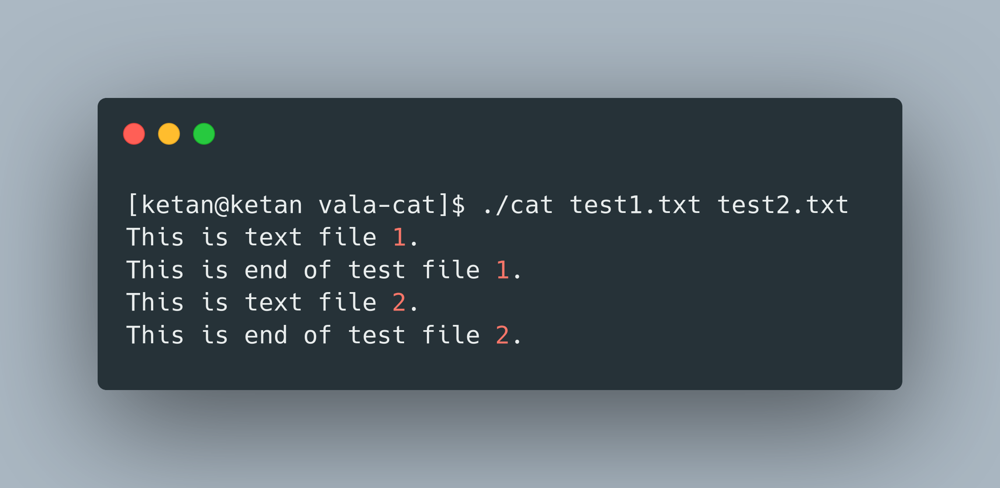

# Vala-cat


The cat command in Linux concatenates and displays the content of one or more files.
It is often used to quickly view the contents of a file, and it can also be used to concatenate and display the contents of multiple files in the terminal.

## Usage

```bash
$ ./cat [FILENAME]...
```

If FILENAME is not provided, it would take input from Standard Input.
You have to add [End-of-Transmission_character](https://en.wikipedia.org/wiki/End-of-Transmission_character)
In Linux, Press Ctrl + D to add EOT character.

## Output



## How To Compile

1. Install Vala for your distribution
2. Install Libgee for you distribution
3. Run `valac --pkg gee-0.8 ./cat.vala`